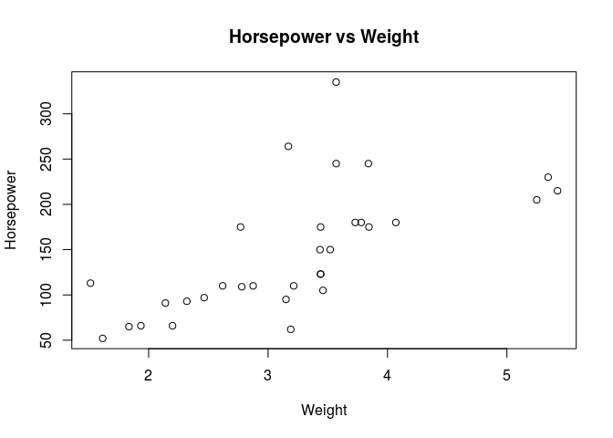

## Data read-in


```r
data("mtcars") # this dataset presents various features for 32 different cars 
```

## Data Exploration


```r
head(mtcars) # shows the first few rows of the dataset
```

```
##                    mpg cyl disp  hp drat    wt  qsec vs am gear carb
## Mazda RX4         21.0   6  160 110 3.90 2.620 16.46  0  1    4    4
## Mazda RX4 Wag     21.0   6  160 110 3.90 2.875 17.02  0  1    4    4
## Datsun 710        22.8   4  108  93 3.85 2.320 18.61  1  1    4    1
## Hornet 4 Drive    21.4   6  258 110 3.08 3.215 19.44  1  0    3    1
## Hornet Sportabout 18.7   8  360 175 3.15 3.440 17.02  0  0    3    2
## Valiant           18.1   6  225 105 2.76 3.460 20.22  1  0    3    1
```

```r
str(mtcars) # gives info about the variables in data
```

```
## 'data.frame':	32 obs. of  11 variables:
##  $ mpg : num  21 21 22.8 21.4 18.7 18.1 14.3 24.4 22.8 19.2 ...
##  $ cyl : num  6 6 4 6 8 6 8 4 4 6 ...
##  $ disp: num  160 160 108 258 360 ...
##  $ hp  : num  110 110 93 110 175 105 245 62 95 123 ...
##  $ drat: num  3.9 3.9 3.85 3.08 3.15 2.76 3.21 3.69 3.92 3.92 ...
##  $ wt  : num  2.62 2.88 2.32 3.21 3.44 ...
##  $ qsec: num  16.5 17 18.6 19.4 17 ...
##  $ vs  : num  0 0 1 1 0 1 0 1 1 1 ...
##  $ am  : num  1 1 1 0 0 0 0 0 0 0 ...
##  $ gear: num  4 4 4 3 3 3 3 4 4 4 ...
##  $ carb: num  4 4 1 1 2 1 4 2 2 4 ...
```

```r
ncol(mtcars) # outputs the number of columns (aka the number of features)
```

```
## [1] 11
```

```r
nrow(mtcars) # outputs the number of rows (aka the number of data points)
```

```
## [1] 32
```

```r
summary(mtcars) # summarizes the data
```

```
##       mpg             cyl             disp             hp       
##  Min.   :10.40   Min.   :4.000   Min.   : 71.1   Min.   : 52.0  
##  1st Qu.:15.43   1st Qu.:4.000   1st Qu.:120.8   1st Qu.: 96.5  
##  Median :19.20   Median :6.000   Median :196.3   Median :123.0  
##  Mean   :20.09   Mean   :6.188   Mean   :230.7   Mean   :146.7  
##  3rd Qu.:22.80   3rd Qu.:8.000   3rd Qu.:326.0   3rd Qu.:180.0  
##  Max.   :33.90   Max.   :8.000   Max.   :472.0   Max.   :335.0  
##       drat             wt             qsec             vs        
##  Min.   :2.760   Min.   :1.513   Min.   :14.50   Min.   :0.0000  
##  1st Qu.:3.080   1st Qu.:2.581   1st Qu.:16.89   1st Qu.:0.0000  
##  Median :3.695   Median :3.325   Median :17.71   Median :0.0000  
##  Mean   :3.597   Mean   :3.217   Mean   :17.85   Mean   :0.4375  
##  3rd Qu.:3.920   3rd Qu.:3.610   3rd Qu.:18.90   3rd Qu.:1.0000  
##  Max.   :4.930   Max.   :5.424   Max.   :22.90   Max.   :1.0000  
##        am              gear            carb      
##  Min.   :0.0000   Min.   :3.000   Min.   :1.000  
##  1st Qu.:0.0000   1st Qu.:3.000   1st Qu.:2.000  
##  Median :0.0000   Median :4.000   Median :2.000  
##  Mean   :0.4062   Mean   :3.688   Mean   :2.812  
##  3rd Qu.:1.0000   3rd Qu.:4.000   3rd Qu.:4.000  
##  Max.   :1.0000   Max.   :5.000   Max.   :8.000
```

```r
?mtcars # gives more info about dataset
mtcars$hp # outputs the horsepower for each datapoint
```

```
##  [1] 110 110  93 110 175 105 245  62  95 123 123 180 180 180 205 215 230
## [18]  66  52  65  97 150 150 245 175  66  91 113 264 175 335 109
```

```r
var(mtcars$hp) # outputs the variance of car horsepowers
```

```
## [1] 4700.867
```

```r
plot(mtcars$wt, mtcars$hp, main = "Horsepower vs Weight", xlab = "Weight", ylab = "Horsepower") # plots the horsepower of the cars versus weight of the cars
```

<!-- -->

```r
model = lm(mtcars$hp ~ mtcars$wt) # creates a linear regression model where horsepower is the response variable and weight is the explanatory variable
summary(model) # prints a summary of model which includes the y-intercept = -1.821, the slope = 46.160, and the adjusted R-squared = 0.4151
```

```
## 
## Call:
## lm(formula = mtcars$hp ~ mtcars$wt)
## 
## Residuals:
##     Min      1Q  Median      3Q     Max 
## -83.430 -33.596 -13.587   7.913 172.030 
## 
## Coefficients:
##             Estimate Std. Error t value Pr(>|t|)    
## (Intercept)   -1.821     32.325  -0.056    0.955    
## mtcars$wt     46.160      9.625   4.796 4.15e-05 ***
## ---
## Signif. codes:  0 '***' 0.001 '**' 0.01 '*' 0.05 '.' 0.1 ' ' 1
## 
## Residual standard error: 52.44 on 30 degrees of freedom
## Multiple R-squared:  0.4339,	Adjusted R-squared:  0.4151 
## F-statistic:    23 on 1 and 30 DF,  p-value: 4.146e-05
```
